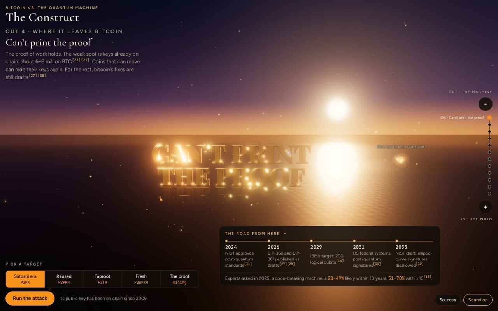

# THE CONSTRUCT — Bitcoin vs. The Quantum Machine

An infinite-zoom explorable. Zoom **in** from a person holding a wallet down to the elliptic-curve math that locks a
bitcoin. Zoom **out** and the quantum machine it would take to break that math assembles around you, standing on a
dark sea at dawn.

Honest in both directions — never doom, never cope.

**Play it:** https://sene1337.github.io/quantum-construct/



## What it says

- **Proof of work is not what a quantum computer breaks.** Grover's algorithm speeds up search by a square root at
  most, and it splits badly across machines. Out-mining the network that way would take about 10²³ qubits and
  10²⁵ watts. They can't print the proof either.
- **Signatures are the real exposure.** Shor's algorithm can turn a *visible* public key into its private key. Keys
  are visible for pay-to-public-key outputs (including the early coins attributed to Satoshi), for addresses that
  have already spent, and for Taproot outputs. That is about 6.0–8.2 million BTC, depending on who counts.
- **What the machine would need.** Google's 2026 estimate: 1,200–1,450 logical qubits, under 500,000 physical
  qubits, 9–23 minutes a key. Designs with fewer qubits (trapped ions, neutral atoms) take days to years a key.
  Today's best machines run about 100 logical qubits on small codes; the largest elliptic-curve key broken on
  quantum hardware has 15 bits. Bitcoin's have 256.
- **What fixes it.** Coins that can move can hide their keys again: send them to a fresh address and stop reusing
  addresses. For the rest there are drafts: BIP-360 (P2MR, a Taproot-like output without the key path) and BIP-361
  (a migration and sunset plan). No post-quantum signature has a BIP number yet.

Pick a target (Satoshi-era coin, reused address, Taproot, fresh address, or the proof of work itself), then
**Run the attack**: the construct flies to where that target is decided, runs Shor's or Grover's algorithm on it,
and gives a verdict with what fixes it.

Scroll or pinch to travel the axis · drag to look around · `+` / `−` or the arrow keys to step · `1`–`5` pick a
target.

## Sources

Every number on the page links to this list, which is also on the page (the **Sources** button). Where sources
disagree, the page shows the range. Checked on 26 September 2026. The numbers live in one file,
[`js/facts.js`](js/facts.js).

1. **Babbush, Gidney, Boneh, Drake et al. (Google Quantum AI), 2026.** "Securing elliptic curve cryptocurrencies against quantum vulnerabilities: resource estimates and mitigations", arXiv:2603.28846, v2 15 April 2026. Under 1,200 logical qubits and 90 million Toffoli gates, or under 1,450 and 70 million; under 500,000 physical qubits at a 0.1% error rate; 18 or 23 minutes a key, about 9 or 12 from a precomputed start; on-spend success just under 41% against 10-minute blocks; 1.7 million BTC in P2PK; about 6.9 million BTC in vulnerable addresses; proof-of-work section. Circuits withheld; checked by a zero-knowledge proof. <https://arxiv.org/abs/2603.28846>
2. **Häner, Tripier, Young et al. (IonQ), 2026.** "Computing 256-bit elliptic curve discrete logarithms in 26 days on a fault-tolerant trapped-ion quantum computer with 20,000 qubits", arXiv:2609.05625, 4 September 2026. 19,397 physical qubits, about 1,450 logical, 25.7 days per attempt. <https://arxiv.org/abs/2609.05625>
3. **Cain, Xu, King et al. (Oratomic, Caltech, UC Berkeley), 2026.** "Shor's algorithm is possible with as few as 10,000 reconfigurable atomic qubits", arXiv:2603.28627, 30 March 2026. Neutral atoms, Figure 3c: about 26,000 qubits for about 10 days per key (preliminary; assumes a 1 ms cycle); 9,739 qubits for about 1,000 days. <https://arxiv.org/abs/2603.28627>
4. **Roetteler, Naehrig, Svore, Lauter, 2017.** "Quantum resource estimates for computing elliptic curve discrete logarithms", ASIACRYPT 2017, arXiv:1706.06752. 2,330 logical qubits and about 1.26 × 10¹¹ Toffoli gates for a 256-bit curve. <https://arxiv.org/abs/1706.06752>
5. **Webber, Elfving, Weidt, Hensinger, 2022.** "The impact of hardware specifications on reaching quantum advantage in the fault tolerant regime", AVS Quantum Science 4, 013801. 13 million physical qubits to break a bitcoin key in one day; 317 million in one hour. <https://doi.org/10.1116/5.0073075>
6. **Google Quantum AI, Willow spec sheet, December 2024.** 105 qubits. <https://quantumai.google/static/site-assets/downloads/willow-spec-sheet.pdf>
7. **Google Quantum AI, 2024.** "Quantum error correction below the surface code threshold", arXiv:2408.13687 (Nature 638, 2025). A distance-7 surface-code memory at 0.143% error per cycle. <https://arxiv.org/abs/2408.13687>
8. **IBM, December 2023.** "The hardware and software for the era of quantum utility is here". Condor: 1,121 superconducting qubits on one chip. <https://www.ibm.com/quantum/blog/quantum-roadmap-2033>
9. **Quantinuum, Nature, 2026.** "A 98-qubit trapped-ion quantum computer with all-to-all connectivity", Nature 655, 81–86. Average two-qubit error 7.9 × 10⁻⁴. <https://pmc.ncbi.nlm.nih.gov/articles/PMC13322971/>
10. **Quantinuum, 2026.** "Computing with many encoded logical qubits beyond break-even", arXiv:2602.22211. Between 48 and 94 logical qubits: 94 on an error-detecting code, 48 on a distance-4 correcting code, with postselection. <https://arxiv.org/abs/2602.22211>
11. **Harvard, MIT, QuEra, 2025.** "Architectural mechanisms of a universal fault-tolerant quantum computer", arXiv:2506.20661. Up to 448 atoms; up to 96 distance-4 logical qubits at once. <https://arxiv.org/abs/2506.20661>
12. **Caltech, September 2025.** "Caltech team sets record with 6,100-qubit array". Entangling them is the next step. <https://www.caltech.edu/about/news/caltech-team-sets-record-with-6100-qubit-array>
13. **Project Eleven, April 2026.** Q-Day Prize: a 15-bit elliptic-curve key (search space 32,767) broken on cloud quantum hardware; the previous record was 6 bits. <https://www.prnewswire.com/news-releases/project-eleven-awards-1-btc-q-day-prize-for-largest-quantum-attack-on-elliptic-curve-cryptography-to-date-302752439.html>
14. **IBM, June 2025.** Starling, 2029: 200 logical qubits, 100 million operations. <https://newsroom.ibm.com/2025-06-10-IBM-Sets-the-Course-to-Build-Worlds-First-Large-Scale,-Fault-Tolerant-Quantum-Computer-at-New-IBM-Quantum-Data-Center>
15. **Mosca and Piani, Global Risk Institute, March 2026.** Quantum Threat Timeline Report 2025 (26 experts): 28–49% within 10 years, 51–70% within 15. <https://globalriskinstitute.org/publication/quantum-threat-timeline-report-2025b/>
16. **Grover, 1996.** "A fast quantum mechanical algorithm for database search", arXiv:quant-ph/9605043. <https://arxiv.org/abs/quant-ph/9605043>
17. **Bennett, Bernstein, Brassard, Vazirani, 1997.** "Strengths and weaknesses of quantum computing", arXiv:quant-ph/9701001. No quantum search beats Grover's square root. <https://arxiv.org/abs/quant-ph/9701001>
18. **Zalka, 1999.** "Grover's quantum searching algorithm is optimal", arXiv:quant-ph/9711070. Parallel search gains no more than splitting the space. <https://arxiv.org/abs/quant-ph/9711070>
19. **Dallaire-Demers and BTQ Technologies, 2026.** "Kardashev scale quantum computing for bitcoin mining", arXiv:2603.25519 (company preprint). At bitcoin's January 2025 difficulty: about 10²³ qubits and 10²⁵ W; the network uses about 10–15 GW. <https://arxiv.org/abs/2603.25519>
20. **NASA, Sun fact sheet.** Luminosity 3.828 × 10²⁶ W, so 10²⁵ W is about 2.6% of it. <https://nssdc.gsfc.nasa.gov/planetary/factsheet/sunfact.html>
21. **Project Eleven, Bitcoin Risq List, September 2026.** Block 966,848: 8,177,337 BTC in total; P2PK 1,715,434; address reuse 6,188,493; Taproot 273,125. The jump since July is not explained by the publisher. <https://bitcoin-risq-list.projecteleven.com/metrics>
22. **Project Eleven, February 2026.** Block 936,882: 6,909,255 BTC exposed; 4,994,044 through reuse; 1,716,814 in P2PK; 198,106 in Taproot. <https://report.projecteleven.com/section-2/elliptic-curve-digital-signatures>
23. **Glassnode, 20 May 2026.** "Measuring bitcoin's quantum-exposed supply": 6.04 million BTC (30.2%); 4.12 million through reuse; exchanges 1.66 million. <https://research.glassnode.com/measuring-bitcoins-quantum-exposed-supply/>
24. **Lerner, 2019.** "The return of the deniers and the revenge of Patoshi": Satoshi mined close to 1.1 million BTC. <https://bitslog.com/2019/04/16/the-return-of-the-deniers-and-the-revenge-of-patoshi/>
25. **mempool.space, block 1.** Block 1's 50 BTC coinbase, paid to a raw public key, unspent on 26 September 2026. <https://mempool.space/tx/0e3e2357e806b6cdb1f70b54c3a3a17b6714ee1f0e68bebb44a74b1efd512098>
26. **Milton and Shikhelman (Chaincode Labs), May 2025.** "Bitcoin and quantum computing: current status and future directions". <https://chaincode.com/bitcoin-post-quantum.pdf>
27. **BIP-360, Pay-to-Merkle-Root (P2MR).** Status: Draft; merged 11 February 2026. Not in Bitcoin Core, not activated. <https://github.com/bitcoin/bips/blob/master/bip-0360.mediawiki>
28. **BIP-361, Post Quantum Migration and Legacy Signature Sunset.** Status: Draft (Informational); merged 14 April 2026. <https://github.com/bitcoin/bips/blob/master/bip-0361.mediawiki>
29. **Hourglass V2, February 2026.** Cap spending from P2PK outputs at about 1 BTC per block. No BIP number. <https://groups.google.com/g/bitcoindev/c/0E1UyyQIUA0>
30. **SHRINCS draft, August 2026.** A hash-based signature draft; not yet ready for the BIPs repository. <https://groups.google.com/g/bitcoindev/c/HbVboXIFiG8>
31. **NIST, August 2024.** FIPS 203, 204 and 205 approved 13 August 2024. <https://csrc.nist.gov/projects/post-quantum-cryptography>
32. **NIST IR 8547 (initial public draft), November 2024.** Elliptic-curve signatures at 128-bit strength: disallowed after 2035. <https://csrc.nist.gov/pubs/ir/8547/ipd>
33. **US Executive Order 14412, June 2026.** High-value federal systems: post-quantum signatures by 31 December 2031. <https://www.federalregister.gov/documents/2026/06/25/2026-12909/securing-the-nation-against-advanced-cryptographic-attacks>
34. **mempool.space, 26 September 2026.** Height 968,751; recent block hashes; difficulty 1.33 × 10¹⁴; about 9.4 × 10²⁰ hashes a second. <https://mempool.space/block/00000000000000000000ccd4e4e6f0e39b219b1ddabcf065bfa7808303128376>
35. **blockchain.com, 26 September 2026.** Total bitcoin issued: 20,089,834. <https://blockchain.info/q/totalbc>
36. **SEC 2 v2, Certicom Research, 2010.** secp256k1: y² = x³ + 7; group order about 1.16 × 10⁷⁷. <https://www.secg.org/sec2-v2.pdf>
37. **Bernstein and Lange, SafeCurves.** secp256k1: about 2¹²⁷·⁸ steps for the best known classical attack. <https://safecurves.cr.yp.to/rho.html>
38. **Deutsch, 1985.** "Quantum theory, the Church–Turing principle and the universal quantum computer", Proc. R. Soc. A 400, 97–117. <https://doi.org/10.1098/rspa.1985.0070>

## Run it locally

No build step. Serve the folder and open it in a browser:

```
python3 -m http.server 8000        # then open http://localhost:8000
```

It needs WebGL 2 (any recent Chrome, Safari, Firefox or Edge).

## Embed mode

Add `?embed=1` to put the construct in an iframe, for the section "But what about quantum?" on the
*Can't Print the Proof* site:

```html
<iframe src="https://sene1337.github.io/quantum-construct/?embed=1"
        title="The Construct: Bitcoin vs. the quantum machine" loading="lazy" allow="fullscreen"
        style="display:block;width:100%;aspect-ratio:16/9;min-height:560px;max-height:85vh;border:0;border-radius:14px;background:#060504"></iframe>
```

In embed mode:

- the page's own title and intro are hidden (the host section gives the heading) and the scene fills the frame;
- the page around the frame keeps its scroll: wheel and touch pass through until the visitor clicks
  **Enter the construct**; then wheel and pinch zoom, and the **Leave** button or `Esc` gives the scroll back;
- on-screen `+` / `−` buttons step the zoom;
- sound starts off;
- it stops drawing when the frame is off screen or the tab is hidden;
- the device pixel ratio is capped at 1.5.

It works cross-origin and from the same origin (for example `sene1337.github.io/<site>/`).
[`tools/embed-demo.html`](tools/embed-demo.html) is a stand-in host page for testing the embed locally.

## Checks

`node tools/check.mjs --out <folder>` (Node 22 or later, Google Chrome installed) serves the folder with gzip, as
GitHub Pages does, and drives headless Chrome at 1440×900 and 390×844, full page and embedded, and with reduced
motion. It reports console errors, bytes loaded before the first frame, the frame rate, whether the embed passes
scrolling through before Enter and captures it after, and whether it stops drawing off screen. It saves screenshots.

## Files

- `index.html`, `css/construct.css`: the page. Colours, type and controls follow the Sovereignty simulator.
- `js/main.js`: boot, the zoom loop, embed mode. `js/engine.js`: the zoom axis (levels nested at 16× per step).
- `js/levels.js`: the twelve levels. `js/attack.js`: the attack sequences. `js/hud.js`: the page around the scene.
- `js/world.js`: renderer, dawn sky, wet mirror floor, metal, embers, bloom and ACES tone mapping.
- `js/cast.js`: numbers cast in metal from Playfair Display Black outlines (`data/glyphs.json`, made by
  `tools/make-glyphs.py`). `js/labels.js`: text in the scene.
- `js/facts.js`: every number and its source.
- `vendor/three/`: three.js r186 (MIT licence), only the files the page uses.
- `fonts/`: Cormorant Garamond, Figtree, JetBrains Mono and Playfair Display (SIL Open Font License).
